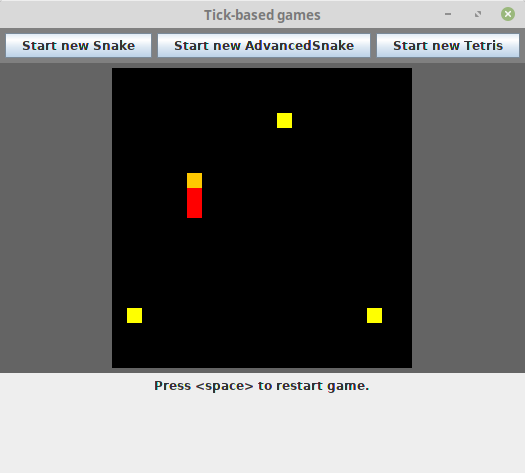

Package `games`
===============

*A GUI with simple 2D games. Scroll down for screenshots!*

This is originally from a course assignment in an OOP course, back in my first year of university. The project has since grown and been altered. I have added additional games, but kept some of the ideas (MVC-pattern with Model inheritance to reuse code) from the course lab assignment.

Background
-----------
### Original assignment
**Using an MVC pattern, in Java's Swing 2D graphics library, implement a GUI for at least two games** from a suggested list (I chose Tic-tac-toe and 15-puzzle). Realising that these games are all very similar implementation-wise, and the View and Controller can be reused, you should do a Model base class / interface and have your games subclass/implement this Model. It should be easy to add a third game simply by just subclassing the Model class (and maybe change a couple of rows in the main program).

### My modifications
After the course assignment was done, I first added Minesweeper as a third game subclassing Model.

Then I wanted to implement the first-in-my-life Snake, but since it is a bit different (threaded, and no user clicking), I ended up mostly creating a new Model/View/Controller while copying a bit of the code. 

Since redrawing the entire board each tick is quite expensive, I changed the Model from being unaware of the View to semi-aware: having the View being an observer/listener of Model, so that it only redraws the squares that have been changed.

Several years later I wanted to clean up the code a bit, and now being a better coder, I was able to abstract a shared skeleton for the category "click games" (Tic-tac-toe, 15-puzzle and Minesweeper) and "tick games" (Snake and other tick based games). They have in common that they are both "matrix games" - there is a simple game grid with squares. I also added Tetris as another "tick game", as well as an "advanced snake" having levels with different topologies/boards. Finally I wanted to make the tick games threading secure, by adding mutex locks where needed.

Current code
------------
The result is a complicated (but motivated) OOP-designed game program where you can choose between different games. There is a makefile, so run `make click` to play the click games, and `make tick` to play the tick games.

Considering the games separately, this OOP design might slow down the games somewhat. But the code "demonstrates" my knowledge of Java and OOP in several areas:

* polymorphism and inheritance, the Java way
* MVC pattern
* Java's Swing library for 2D-graphics
* multithreading and mutex locks, the Java way
* Java's generics
* reflections in Java (a little bit in the Menu class)

Run the code
-----------
In the top directory of this repository, there is a Makefile, which both compiles the code and runs it. There are two types of games, "click games" and "tick games", so run either

    make click
    
to start the **Click games menu**, where you can choose between Tick-tac-toe, 15-puzzle and Minesweeper, or

    make tick
    
to start the **Tick games menu**, where you can choose between Snake (ordinary snake on a torus), Advanced Snake (it has levels with different topologies) and Tetris.

### Software requirements
The latest changes were developed in Java 11, but the code probably supports Java 7, the version I learnt when I took my OOP course and wrote the base for this repository. You also need `make` support to run the Makefiles. To edit the UML diagram, you need the Dia editor.

Code and design overview
-------------------
This repository contains:

* `src/` - the source code
  * `games/` - the top package `games`, contains some shared classes and two subpackages
     * `clickgames/` - package
     * `tickgames/` - package
* `makefile` - a makefile for compiling and running the code
* `bin/` - the binaries will be generated to this location
* `doc/`- explanation of selected parts of the design
  * `img/` - screenshots and other images in the markdown documentation
  * `graphics-uml.dia` - a UML diagram drawn in the [diagram editor *Dia*](https://sourceforge.net/projects/dia-installer/) (`dia` in APT)

Click games
===========
If you run `make click`, you should get the following menu:

Here you may choose between 15-puzzle, Tic-tac-toe and Minesweeper.

15-puzzle
---------

The 15-puzzle is always a valid permutation. You can change the size in the constructor `FifteenPuzzle()` if you want other dimensions like `3x3` or `5x4`; the code supports this too.

Tic-tac-toe
----------

Standard tic-tac-toe.

Minesweeper
-----------

If you cannot render unicode signs, change the code to display `M` for mine and `F` for flag. Search in `MineSweeper.java` for the word "unicode" and change in the function `translateString(int)`.

The controls are

* Left click: uncover that square
* Right click: flag that square, if it is still covered

Double clicking to uncover that square and all its neighbours has not been implemented. However if you uncover an empty square, all its neighbours will be recursively uncovered.

If you want a different size of the board or a different number of mines, change it in the constructor `MineSweeper()`.

Tick games
===========
If you run `make tick`, you should get the following menu:

Here you may choose between snake and tetris.

Snake
------

The controls for Snake are

* arrows left/right/up/down: change direction to west/east/north/south (if possible)
* `space`: restart

Tetris
------

The controls for Tetris are

* arrows left/right: move left or right
* arrow down: move down
* `D`: drop down
* arrow up: rotate counter-clockwise
* `enter`: rotate clockwise
* `space`: restart

Advanced Snake
-------------
This version of Snake has levels, with different topologies. You need to clear a certain number of points to advance to the next level. You can change the number of points to clear at a certain level in `AdvancedSnake.java`, as well as change the order of levels, modify their topology or add new levels. You can learn more about the levels in ["Snake Levels"](doc/snakelevels.md).

If you hit `restart` (by pressing `space`), you will restart at the same level, not at the first level. This is partially for debug purposes, but also because some levels are hard anyway, so I kept it that way. If you want to restart at the first level, start a new game by pressing the "Advanced Snake" button.
