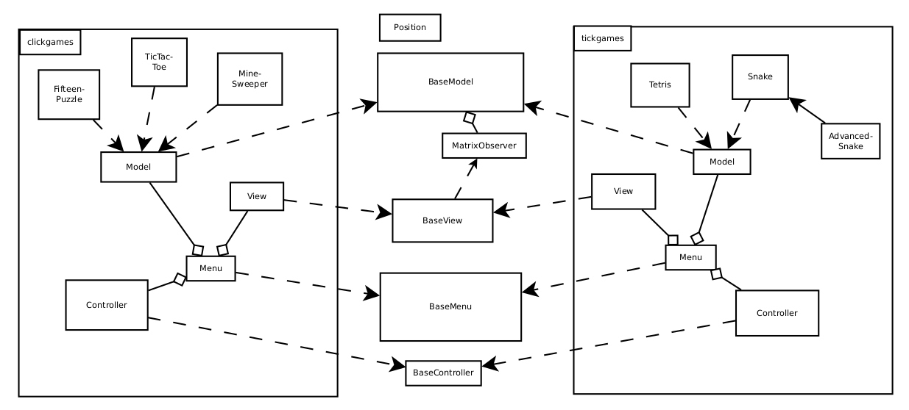

Documentation
-------------

### UML diagram
There is an UML diagram showing the relations between the classes. The obvious MVC-relations between the Model, the View and the Controller are not included, to avoid having the diagram cluttered with relation lines.

Both in **tickgames** and **clickgames**, there is an MVC-pattern. It is quite similar, so these components inherit from abstract base classes `BaseModel`, `BaseView`, and so on.

* The **Model** knows only of itself, but the `BaseModel` has observers that it notifies whenever the game matrix is changed. To add a new game, you should (almost) only have to add a new `Model` subclass.
* The **View** knows about the model, to be able see all attributes like matrix size and choice of colours. It is also a listener on the model, a `MatrixObserver`.
* The **Controller** knows about both the model and the view. It listens to user interaction and holds the timer for the tick-games.

The reason that the view listens to the model, instead of redrawing everything at each tick or user interaction, is that it is faster this way. Now the model implicitly asks the view to update only the few squares that have changed.

### Details
The multithreading safety reasoning is in [a separate file](multithreading.md).

The levels in the "advanced snake" are described in [a separate file](snakelevels.md).

Details of parts of the design are described in [a separate file](design.md).

