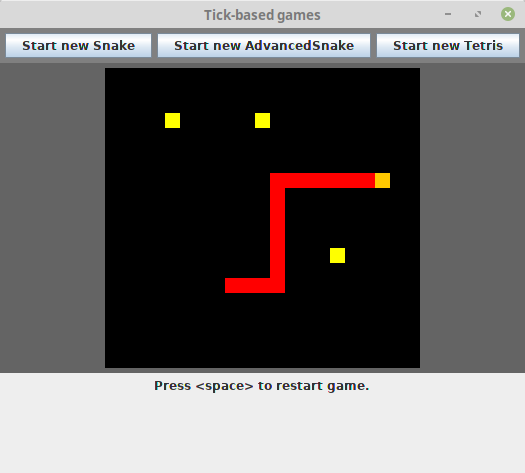

The levels in Advanced Snake
----------------------------

* Ordinary torus
* A square (walls along the edges)
* "Inverted square": the edges have been moved to form a plus and the edges are torus edges.
* Mirrored columns: when exiting north/south you will enter the *same* wall in the mirrored column. Ordinary torus edges in east/west. (Adding a vertical bar wall could be interesting? No, at the same time, this prevents the funny collisions.)
* Four L-corners: 4 L-shaped walls, as if originally in the corners but moved towards the centrum.
* Möbius strip.
* "2D columns": The snake always advances 2 steps when going horizontally and the width is odd, so it is either always in odd or even columns, but changes to the other mode when it exits a wall on the left/right side.

Screenshots from the levels
--------------------------
The pictures are not in the order of the levels.

The first level is ordinary snake on a torus.

Other levels have walls, that the snake cannot pass through. They are coloured gray. If the edges are not marked with walls or *portals* (see below), they are ordinary torus edges.

There are also *portals*. They are walls you can pass through, but you will end up somewhere unexpected (but it is deterministic). They are coloured blue.

Finally, there is a very particular topology - "2D columns" - where the snake always advances two steps *horizontally* (and does not pass through the square it skipped!). 

The number of columns must be odd for the snake to be able to visit all positions. If you exit through an edge while going horizontally, you will be able to reach the other half of the positions. To help you keep track of whether you are in an odd or even position, the snake changes colour between red and green.

Code and design
--------------
The `Advanced Snake` class inherits from the `Snake` class. There is an inner abstract class `Level`. To add a new level, do a `Level` implementation by 

* specifying the number of points to clear the level, 
* overriding the `addWalls()` function specifying where to place walls and portals, and
* overriding the `advance()` function that gives the next position of the snake's head if you pass through an edge or a portal.

To implement the alternating columns functionality, this was done a bit ugly by changing the `Snake` base class. There is a function `isAlt()` telling if you, at the current position, should use the alternative colour green instead of the ordinary red. It defaults to "no", but it is overriden in the `AdvancedSnake` class and optionally overriden in the `Level` class implementation.
